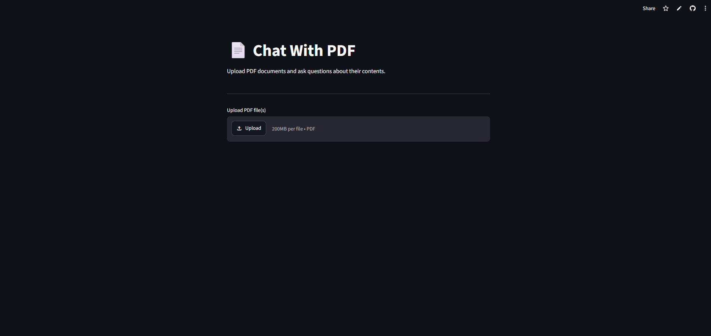
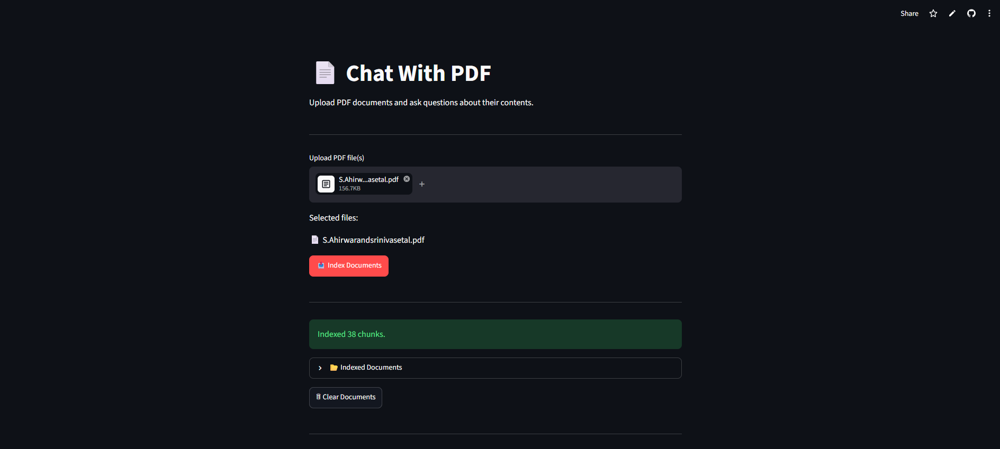
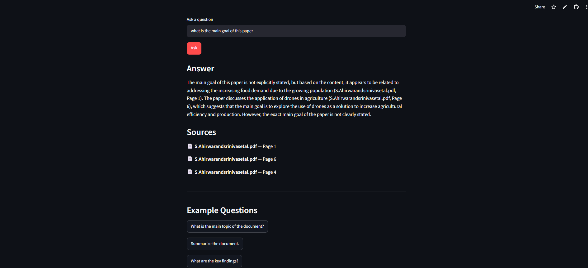

# 📄 Chat with PDFs using RAG

A Streamlit-based AI application that allows users to upload PDF documents and ask questions about their content using **Retrieval-Augmented Generation (RAG)**. The application extracts text from PDFs, generates embeddings, stores them in ChromaDB, retrieves relevant context, and uses the **Groq LLM** to answer user queries.

---

## 🚀 Live Demo

🔗 **Try the App:** https://chat-with-pdfsss.streamlit.app

---

## 📌 Features

- 📄 Upload one or multiple PDF documents
- ✂️ Extract text using PyMuPDF
- 🧩 Split documents into semantic chunks
- 🔍 Generate embeddings for efficient retrieval
- 🗄️ Store embeddings using ChromaDB
- 🤖 Ask natural language questions about uploaded PDFs
- ⚡ Generate AI-powered answers using Groq LLM
- 💻 Interactive and user-friendly Streamlit interface

---

## 🛠️ Tech Stack

| Technology | Purpose |
|------------|---------|
| Python | Programming Language |
| Streamlit | Web Application |
| ChromaDB | Vector Database |
| Sentence Transformers | Text Embeddings |
| Groq API | Large Language Model |
| PyMuPDF | PDF Text Extraction |
| python-dotenv | Environment Variables |

---

## 📂 Project Structure

```text
Chat-with-Pdfs/
│
├── app.py
├── requirements.txt
├── README.md
├── .gitignore
├── .env.example
│
├── src/
│   ├── embeddings.py
│   ├── ingestion.py
│   ├── qa.py
│   └── __init__.py
│
├── pdfs/
├── data/
└── logs/
```

---

## ⚙️ Installation

### 1. Clone the Repository

```bash
git clone https://github.com/Krishna9616/Chat-with-Pdfs.git
cd Chat-with-Pdfs
```

### 2. Create a Virtual Environment

```bash
python -m venv venv
```

### 3. Activate the Virtual Environment

#### Windows

```bash
venv\Scripts\activate
```

#### macOS/Linux

```bash
source venv/bin/activate
```

### 4. Install Dependencies

```bash
pip install -r requirements.txt
```

---

## 🔑 Environment Variables

Create a `.env` file in the project root.

Add your Groq API key:

```env
GROQ_API_KEY=your_groq_api_key
```

---

## ▶️ Run the Application

```bash
streamlit run app.py
```

The application will open automatically in your browser.

---

## 🌐 Deployment

This project is deployed using **Streamlit Community Cloud**.

### Steps to Deploy

1. Push the project to GitHub.
2. Connect the repository to Streamlit Community Cloud.
3. Set the **Main file path** as:

```
app.py
```

4. Add your API key under **App Settings → Secrets**:

```toml
GROQ_API_KEY="your_groq_api_key"
```

---

## 📸 Screenshots

### Home Page




---

### Chat Interface






---

## 💡 How It Works

1. User uploads one or more PDF documents.
2. The application extracts text using **PyMuPDF**.
3. The extracted text is divided into chunks.
4. Sentence Transformer embeddings are generated.
5. Embeddings are stored in **ChromaDB**.
6. When a user asks a question:
   - Similar chunks are retrieved.
   - Retrieved context is sent to the Groq LLM.
   - The AI generates an accurate answer.

---

## 👨‍💻 Author

**Krishna**

- GitHub: https://github.com/Krishna9616
- Project Repository: https://github.com/Krishna9616/Chat-with-Pdfs
- Live Demo: https://chat-with-pdfsss.streamlit.app

---
